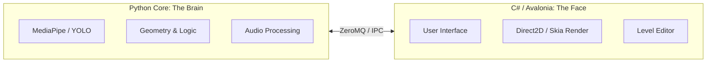

# 🤸 Motion Trainer AI

**Умная платформа для геймификации спорта, танцев и ЛФК с использованием компьютерного зрения.**

> *"Превращаем рутинную зарядку в увлекательную игру, а разучивание танцев — в соревнование."*

---

## 🎯 Концепция

Проект решает проблему скучных тренировок (особенно для детей с СДВГ) через мгновенную визуальную обратную связь.
Это не просто видеоплеер, это **интерактивный тренажер**, который "видит" игрока, оценивает точность движений в реальном времени, начисляет баллы и позволяет создавать свои собственные игровые уровни.

**Ключевые режимы:**
1.  **Геймификация:** Выполнение упражнений за очки (идеально для детей).
2.  **Dance Mode:** Разучивание движений с регулировкой скорости и проверкой точности (как Just Dance).
3.  **Соревнования:** Режим для 2+ игроков перед одной камерой.
4.  **Кино-режим (No Camera):** Использование платформы как плеера для тренировок, если камера недоступна.

---

## 🏗 Архитектура (Hybrid Core)

Проект использует гибридную архитектуру для максимальной производительности и гибкости UI.


* **Backend (Python 3.11):** Отвечает за трекинг позы (MediaPipe), математику скелета и игровой цикл. Работает в headless-режиме, публикует кадры и принимает команды управления.
* **Frontend (C# / Avalonia UI):** Кроссплатформенный интерфейс (Windows/Linux/macOS). Отрисовывает два потока (референс и пользователь), показывает статус и отправляет команды (load/pause/resume).
* **Транспорт:** **ZeroMQ**: PUB/SUB для кадров и REQ/REP для команд.

---

## 📦 Формат данных: .MTP (Motion Trainer Package)

Контент хранится в универсальных контейнерах (ZIP-архив с расширением `.mtp`). Это позволяет легко обмениваться тренировками.

**Текущая структура (MTP v2):**
* `manifest.json` — метаданные и ссылки на файлы.
* `patterns.json` — "цифровая партитура" движений (углы по таймлайну).
* `video.mp4` — основной референсный ролик.
* `timeline.json` — сценарий событий (опционально).

---

## 🚀 Roadmap (План разработки)

### Фаза 1: Python MVP (Выполнено ✅)
* [x] Базовый трекинг тела (MediaPipe Pose).
* [x] Математика сравнения углов (Cosine similarity / Euclidean distance).
* [x] Оцифровщик видео (создание JSON-партитур).
* [x] Прототип игрового движка (Split-screen, счетчики).

### Фаза 2: Гибридное ядро (В процессе ✅)
* [x] Реализация IPC (ZeroMQ) между Python и C#.
* [x] Канал команд (load/pause/resume/digitize).
* [x] Рендеринг двух видеопотоков (референс + пользователь) в Avalonia.
* [x] Загрузка .mtp v2 (manifest + patterns + video).

### Фаза 3: Платформа и Редактор
* [ ] **Редактор уровней (UI):** Визуальный таймлайн для создания `.mtp` пакетов.
* [ ] **Timeline-движок:** Выполнение событий `timeline.json`.
* [ ] **Управление медиа:** Синхронизация звука, видео и оверлеев.

### Фаза 4: Геймплей и AI
* [ ] **Multi-User Tracking:** Поддержка анализа группы людей (сортировка скелетов, идентификация).
* [ ] **Режим "Без камеры":** Воспроизведение тренировки без скоринга.
* [ ] **Сложные триггеры:** Детекция прыжков, приседаний, касаний (носа, пола).

---

## 🛠 Технологический стек

**Core (Backend):**
* Python 3.11
* `mediapipe` / `ultralytics` (AI Tracking)
* `numpy` (Math)
* `pyzmq` (Transport)
* `ffpyplayer` (опционально, звук)

**UI (Frontend):**
* C# .NET 10
* Avalonia UI (Framework)
* `NetMQ` (Transport)
* `FFmpeg` (Media decoding optional)

---

## ⚙️ Установка (Для разработчиков)

### Предварительные требования
* Python 3.11+
* .NET 10.0 SDK
* Веб-камера

### Запуск (Текущая Python версия)

```bash
# 1. Клонирование
git clone https://github.com/qSerj/Motion.git

# 2. Python окружение
cd Motion
python -m venv .venv
source .venv/bin/activate  # или .venv\Scripts\activate на Windows
pip install -r backend/requirements.txt

# 3. Запуск backend (ожидает команды от UI)
python backend/play_game.py
```

### Запуск Frontend (C# / Avalonia)

```bash
# 1. Переход в папку фронтенда
cd frontend

# 2. Сборка и запуск приложения
dotnet run --project frontend/Motion.Desktop
```

> При необходимости сначала соберите решение: `dotnet build frontend/Motion.sln`.

---

## 🤝 Контрибьютинг

Проект находится в стадии активной трансформации из скрипта в платформу.
Мы приветствуем помощь в:
* Разработке UI на Avalonia.
* Оптимизации пайплайна ZeroMQ.
* Создании новых алгоритмов оценки движений.
